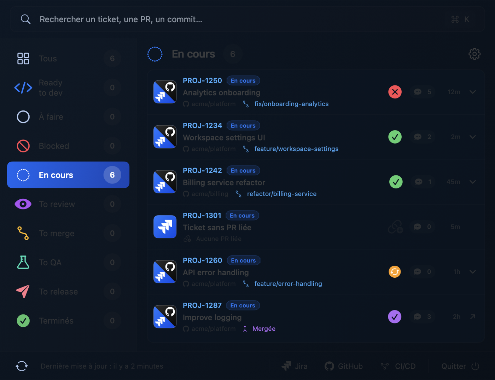
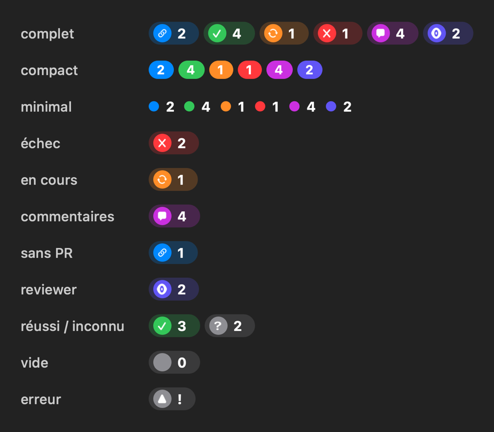
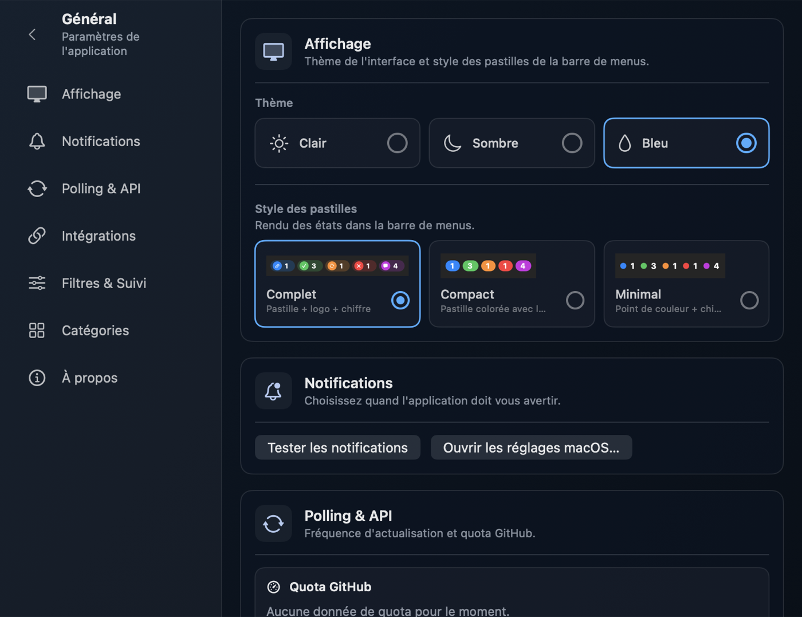

# GitHub Jira Tracker

Native macOS menu bar app to track the GitHub pull requests opened by the user in `dktunited`, their GitHub Actions CI, the related Jira tickets, and the tickets where the user is the **Code Reviewer**.

## Screenshots

### Main view

Unified view of Jira tickets and their PRs, with CI status, conversations and a **Reviewer** filter.



### Menu bar

Three badge styles: **Full** (pill + logo + number), **Compact** (colored pill with the number) and **Minimal** (color dot + number).

Order: no PR (blue) › CI passed › CI running › CI failed › unresolved comments (purple) › unknown (gray) › **to review** (indigo, eye).



### Settings

Interface theme and menu bar badge style.



## Requirements

- macOS 13 or later;
- Swift 6 toolchain (Xcode 16+);
- Git;
- a fine-grained GitHub PAT allowed by `dktunited` with `Metadata: Read`, `Pull requests: Read`, `Actions: Read` and `Checks: Read`.

Check your Swift installation:

```sh
swift --version
```

## Local setup

Clone the repository and move to its root:

```sh
git clone <REPO_URL>
cd github-jira-system-tray
```

Swift dependencies are fetched automatically by Swift Package Manager on the first build.

## Running the app

The app must run from a macOS app bundle: `UserNotifications` requires a bundle, so launching the bare binary (for example `swift run` or `.build/debug/GitHubJiraSystemTray`) crashes immediately with `bundleProxyForCurrentProcess is nil`.

Build the bundle and open it:

```sh
sh Scripts/build-app.sh
open "dist/GitHub Jira Tracker.app"
```

The app runs in the menu bar and shows no window in the Dock. Quit it from the footer or run `pkill -f GitHubJiraSystemTray`.

To pass GitHub and Jira environment variables, launch the bundle binary directly:

```sh
export GITHUB_TOKEN="github_pat_..."
export JIRA_EMAIL="first.last@example.com"
export JIRA_TOKEN="..."
env "dist/GitHub Jira Tracker.app/Contents/MacOS/GitHubJiraSystemTray"
```

The app also reads `GH_TOKEN`. For Jira, `JIRA_API_TOKEN`, `JIRA_API_KEY`, `JIRA_PAT`, `ATLASSIAN_API_TOKEN` and `ATLASSIAN_TOKEN` are also recognized for the token. Validated tokens are stored in the macOS Keychain and are never written to the cache.

The authentication button can also read a simple `GITHUB_TOKEN=...` or `export GITHUB_TOKEN=...` assignment from `~/.zshrc`, without executing the shell.

## Demo mode

To explore the UI without configuring GitHub or Jira (fake data, no network calls):

```sh
sh Scripts/demo.sh
```

Useful variables: `JIRA_TRACKER_THEME=white|black|blue` to force a theme, and `JIRA_TRACKER_SCREENSHOT=/tmp/pop.png` (or `JIRA_TRACKER_SETTINGS_SCREENSHOT`, `JIRA_TRACKER_BADGES_SCREENSHOT`) to export screenshots.

## Build

Build in debug mode without running the app:

```sh
swift build
```

Build in release mode:

```sh
swift build -c release
```

The binary is then available at `.build/release/GitHubJiraSystemTray`.

## Build and run the macOS app

The script below builds in release, creates `dist/GitHub Jira Tracker.app` and applies a local ad-hoc signature:

```sh
sh Scripts/build-app.sh
open "dist/GitHub Jira Tracker.app"
```

The local signature is required for some macOS notifications. The app is not notarized and is not distributable as-is to other users.

## Tests

```sh
swift test
```

Tests use Swift Testing as a development dependency so they can run with the Command Line Tools alone.

## Troubleshooting

- If `swift` is not found, install Xcode or the Command Line Tools, then run `xcode-select --install`.
- If running the bare binary crashes with `bundleProxyForCurrentProcess is nil`, launch the app from the bundle instead (see above).
- If the app seems not to start, check the menu bar: it is configured as an app without a Dock icon.
- If Jira or GitHub does not respond, check the environment variables, the token permissions and network access.
- For a clean build, delete `.build/` and run `swift build` again.

## Features

GitHub and Jira tracking is implemented: PR discovery, GitHub Actions tracking by SHA, lazy job details, review conversations, numbered badges, local caches, adaptive polling, Keychain and macOS notifications. The main view groups assigned tickets, tickets where the user is Code Reviewer and their PRs, and flags stale data. Status icons are Lucide SVGs (ISC) rendered in the app colors.

### Reviewer tracking

Tickets where the user is set in the Jira **Code Reviewer** field (`customfield_11268`) and sitting in a review status (for example `To Review`) are tracked through the configurable Jira JQL (default clause `cf[11268] = currentUser()`). For each one, the app queries the Jira dev-status API (GitHub integration) to find the linked PR, then the GitHub GraphQL API to inspect the review conversations.

The ticket is kept in the menu bar (indigo eye badge) only when the branch is ready **and** a review action remains:

- the linked PR is not a *draft* and its checks are neither failing nor running;
- either the user has not commented yet (review to do), or all of their review threads are resolved.

The ticket is hidden while its threads are unresolved (the author must address the feedback), and leaves the tracking as soon as it exits the `To Review` status. A **Reviewer** filter in the sidebar, plus a marker on each row, helps find these tickets in the unified view.

Sorting is configured in **Settings › Filters & Tracking**: a multi-criteria sort can be composed. Jira statuses are discovered dynamically from the workflows of each tracked project, and priorities are loaded from Jira. GitHub CI states and the open, draft, merged or no-PR states can be ordered separately. The configuration is applied live and kept in the local preferences.
